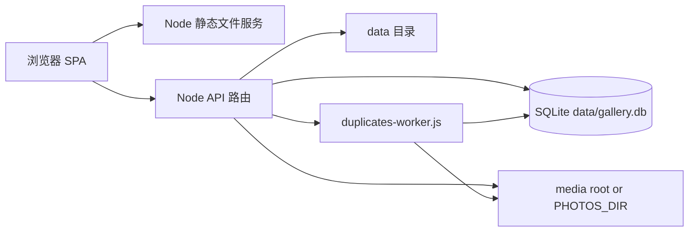

# 网站项目交接与维护文档

> 新项目基线说明（2026-07-11）：当前唯一维护目录为 `<project-root>`。本项目从 `<legacy-project-root>` 的实际运行工作树选择性迁移，旧目录保持只读。当前源码版本为 `v90`，正式站点在本次部署前仍为`v89`；SQLite访问日志分页与媒体清理历史报告重启恢复均已正式启用。生产数据库、媒体、日志和生成缓存未迁入 Git，运行时通过 `PHOTOS_DIR`、`DATA_DIR` 等环境变量挂载。迁移来源和文件映射以 `docs/MIGRATION_SOURCE.md`、`docs/MIGRATION_MANIFEST.md` 为准。下文保留迁移前审计数据用于追溯，其中路径、统计数量、进程状态和 `v69` 等时间点信息不代表新项目当前状态。

> 当前增量（2026-07-15）：`v90`已把媒体清理的v86永久删除改为项目回收站。设置页`#/__settings/media-cleanup`通过`/api/media-cleanup/recycle`与`/restore`执行localhost显式确认；旧`/delete`返回410。源和目标只由服务端`PHOTOS_DIR`、`TRASH_DIR`与批准报告解析，完整说明见`docs/MEDIA_LIBRARY_CLEANUP_SETTINGS.md`。

> 当前增量（2026-07-15）：首页收藏/最近观看迁入`#/__settings/favorites`和`#/__settings/history`；访问日志迁入SQLite，GET使用`page/pageSize`服务端分页，默认50、最大100，并按UTC保留365天。旧NDJSON流式幂等导入且原文件保留。

> V1.0.1 迁移冻结说明：功能镜像提交为 `acf83e61afbade5ede48e2b7dd29e04531554f04`，初始标签为 `migration-functional-baseline`；V1.0.1 完成后使用 `v1.0-migration` 作为长期迁移冻结标签。本阶段只补强文档和 Git 安全审计，没有启动网站，也没有修改端口、媒体/数据目录、数据库、API 或业务代码。隔离验证详情和已知继承风险见 `docs/MIGRATION_SOURCE.md`。

## 1. 文档目的与审计基线

本文档用于新的 Codex 工作区或开发人员在没有历史对话上下文的情况下接手当前写真图集网站。本文档只以当前仓库文件、实际入口、运行接口、SQLite 数据库、启动脚本和本次审计命令结果为依据。

### 1.1 文档基线

| 项目 | 当前值 |
|---|---|
| 文档生成日期 | 2026-07-10 |
| 工作区根目录 | `<legacy-workspace-root>` |
| 实际网站 Git 根目录 | `<legacy-project-root>` |
| 文档输出路径 | `<legacy-workspace-root>\网页.md` |
| Git 分支 | `feature/sqlite-index-api` |
| Git commit | `6e3b275b2598fc19751116af71983b43e83bf960` |
| 审计前工作区是否干净 | 否 |
| 审计前未提交修改 | `app.js`、`gallery-db.js`、`index.html`、`server.js`、`styles.css` |
| 审计前未跟踪文件 | `duplicates-worker.js` |
| 本文档创建后新增未跟踪文件 | `网页.md` |
| 当前前端版本号来源 | `app.js` 中 `APP_VERSION = "v69"`，`index.html` 使用 `app.js?v=69` 与 `styles.css?v=69` |
| 当前数据源 | SQLite，`/api/config` 返回 `{"dataSource":"sqlite","useSqliteApi":true}` |

### 1.2 本次实际执行的检查

| 检查项 | 命令或方法 | 结果 |
|---|---|---|
| Git 根目录 | `git rev-parse --show-toplevel` | `photo-gallery-site` 是实际 Git 根目录 |
| Git 分支 | `git branch --show-current` | `feature/sqlite-index-api` |
| Git commit | `git rev-parse HEAD` | `6e3b275b2598fc19751116af71983b43e83bf960` |
| Git 状态 | `git status --short` | 有未提交修改和未跟踪文件 |
| Node 版本 | `node -v` | `v24.14.0` |
| Node 内置 SQLite | `process.versions.sqlite` | `3.51.2` |
| 后端语法检查 | `node --check server.js` | 通过 |
| 前端语法检查 | `node --check app.js` | 通过 |
| 数据库模块语法检查 | `node --check gallery-db.js` | 通过 |
| 查重 worker 语法检查 | `node --check duplicates-worker.js` | 通过 |
| 首页 HTTP | `GET /` | 200 |
| SQLite 配置 API | `GET /api/config` | 200，SQLite 模式 |
| SQLite 统计 API | `GET /api/index/stats` | 200 |
| 首页集合 API | `GET /api/collections/root` | 200 |
| 轮播 API | `GET /api/highlights` | 200 |
| 搜索 API | `GET /api/search?q=杨晨晨&limit=5` | 200 |
| 查重状态 API | `GET /api/duplicates/status` | 200，当前返回 `running` |
| 扫描状态 API | `GET /api/scan/status` | 200，当前返回 `idle` |
| 访问日志 API | `GET /api/access-log?limit=3` | 200 |
| 旧 JSON API | `GET /api/gallery` | 410，已禁用 |

### 1.3 未执行或未验证项目

| 项目 | 状态 | 原因 |
|---|---|---|
| npm build/lint/typecheck/test | 未执行 | 当前目录未发现 `package.json`，不存在 npm scripts |
| Docker 构建 | 未执行 | 未发现 Dockerfile 或 docker-compose |
| 自动化浏览器视觉测试 | 未执行 | 本次通过 HTTP/API 和代码调用链审计，未调用浏览器自动化工具 |
| 删除图片功能实测 | 未执行 | 会移动真实文件到回收站，属于有副作用操作 |
| HLS 转码实测 | 未执行 | 会生成分段文件并消耗 CPU/磁盘 |
| 扫描任务实测 | 未触发 | 会遍历大媒体目录，本次只读状态 |

## 2. 项目概述

这是一个本地/局域网/ZeroTier 可访问的写真图集浏览网站。核心用途是把服务器本地图片和视频目录索引为可浏览的网页图库，支持：

- 首页按模特或一级目录浏览。
- 任意层级目录浏览。
- 图片图集详情页。
- 视频卡片播放，默认不预加载大视频。
- 首页亮点轮播。
- 搜索模特、目录、作品和媒体。
- 收藏、最近观看。
- 显示设置。
- 图片查重、标记、移动到回收站文件夹。
- 访问日志。
- SQLite 索引和后台扫描。

当前项目不是上传型图库系统。未发现账号、注册、登录、用户权限、上传图片、上传视频、在线编辑图集等功能。

## 3. 当前运行状态

| 项目 | 当前状态 |
|---|---|
| 当前服务进程 | `node.exe server.js` |
| 审计时进程 PID | `56872` |
| 监听地址 | `0.0.0.0` |
| 端口 | `48101` |
| 本机访问 | `http://127.0.0.1:48101/#/` |
| 局域网访问 | `http://192.168.31.153:48101/#/`，以实际服务器 IP 为准 |
| ZeroTier 访问 | `http://192.168.192.1:48101/#/`，以实际 ZeroTier IP 为准 |
| 当前媒体索引 | SQLite，`data/gallery.db` |
| 当前媒体统计 | `collectionCount=7262`，`mediaCount=514035`，`imageCount=511939`，`videoCount=2096`，`scanStateCount=7413` |
| 当前查重任务 | `/api/duplicates/status` 返回 `running`，审计时已处理数量约 `87125` |
| 当前扫描任务 | `/api/scan/status` 返回 `idle` |
| 旧 JSON 状态 | `data/gallery.json` 仍存在，但 `/api/gallery` 返回 410，主服务不再使用 |

## 4. 技术栈与依赖

| 层级 | 技术 |
|---|---|
| 前端 | 原生 HTML + CSS + JavaScript |
| 前端入口 | `index.html` 引入 `styles.css?v=69` 和 `app.js?v=69` |
| 后端 | Node.js 原生 `http` 服务 |
| 后端入口 | `server.js` |
| 数据库 | SQLite |
| SQLite 访问方式 | Node 24 内置 `node:sqlite` 的 `DatabaseSync` |
| ORM | 未发现 ORM |
| 包管理器 | 未发现 `package.json`、`package-lock.json`、`pnpm-lock.yaml`、`yarn.lock` |
| 视频工具 | 可配置 `FFMPEG_PATH`、`FFPROBE_PATH`，默认尝试 `ffmpeg`/`ffprobe` |
| 进程管理 | 当前主要通过命令行或 `.cmd/.ps1` 启动；未发现 PM2、NSSM、Windows Service 配置 |
| Docker | 未发现 Docker 配置 |

## 5. 用户使用说明

### 5.1 首页浏览

1. 打开 `http://服务器IP:48101/#/`。
2. 首页上方显示搜索框和设置按钮。
3. 页面主体显示同步状态、面包屑、亮点轮播和模特/一级目录网格；收藏与观看历史入口位于设置页。
4. 点击模特卡片进入对应目录。
5. 点击轮播图会跳转到该图片所属图集。

### 5.2 搜索

1. 在顶部搜索框输入关键词。
2. 前端调用 `/api/search?q=<关键词>&limit=80`。
3. 搜索结果分为目录和媒体。
4. 清空搜索框后恢复当前页面列表。

### 5.3 浏览图集

1. 从首页点击一级目录。
2. 如果目录有子目录，显示子目录网格。
3. 如果目录有图片或视频，显示媒体详情。
4. 如果目录同时有子目录和媒体，顶部显示子目录，下方显示本级媒体。
5. 图片详情页使用分批加载，默认懒加载开启。

### 5.4 图片预览

1. 点击详情页图片进入灯箱。
2. 灯箱支持上一张、下一张、关闭、缩小、复位、放大、打开图片路径。
3. 鼠标滚轮在灯箱中用于缩放图片。
4. 放大后可拖动查看细节，拖动边界受限制。
5. 键盘支持 `Esc`、左右方向键、`+`、`-`、`0`。

### 5.5 视频播放

1. 视频卡片默认只显示 poster 或封面，不直接加载完整视频。
2. `video` 标签默认使用 `preload="none"` 或 `metadata`。
3. 用户点击或播放时才加载视频地址。
4. 视频静态文件通过 `/photos/...` 返回，支持 HTTP Range。

### 5.6 设置

进入 `#/__settings`。设置页左侧菜单按顺序包含：

- 收藏图册（`#/__settings/favorites`）。
- 观看历史（`#/__settings/history`）。
- 显示设置。
- 图片查重。
- 媒体库清理。
- 访问日志。

显示设置可以调整每行数量、Cover 显示方式、懒加载、白天/夜间、排序、置顶、刷新图片目录。

### 5.7 图片查重

进入 `#/__settings/duplicates`。

- “扫描本地图片/停止扫描”：根据当前查重任务状态启动或停止查重 worker。
- “刷新结果”：刷新查重状态和重复组。
- “删除已标记”：把已标记项剪切到回收站目录。
- “一键删除重复图片”：每组保留一张，其余剪切到回收站目录，单次最多处理 500 张。
- “上一张/下一张”：切换重复组。
- “打开文件夹”：调用服务端打开图片所在目录。

删除类操作只允许本机请求，远程请求会被后端拒绝。

### 5.8 访问日志

进入 `#/__settings/access-log`。

- 显示最近访问记录。
- 记录时间、IP、类型、模特、图集。
- 点击刷新或分页调用 `/api/access-log?page=<page>&pageSize=50`；页面显示首/上/附近页码/下/末、当前页、总页数和总记录数。

## 6. 页面与路由总览

| 页面名称 | 路由 | 入口文件 | Layout | 访问条件 | 用途 | 数据来源 | 当前状态 |
|---|---|---|---|---|---|---|---|
| 首页 | `#/` | `index.html` + `app.js` | `header.topbar` + `main.page` | 无登录要求 | 浏览一级目录和轮播 | `/api/collections/root`、`/api/highlights` | v88隔离浏览器通过 |
| 任意目录页 | `#/<pathParts...>` | `app.js` | 同上 | 目录存在 | 浏览子目录或媒体详情 | `/api/collections/:id`、`/api/media` | 已验证部分路径 |
| 设置页 | `#/__settings` | `app.js` | 同上 + `settings-page` | 无登录要求 | 显示设置 | 前端状态 + localStorage | 已确认 |
| 收藏图册 | `#/__settings/favorites` | `app.js` | 设置页内嵌 | 无登录要求 | 查看/取消收藏并进入原图册 | `/api/favorites` + localStorage兜底 | v88隔离浏览器通过 |
| 观看历史 | `#/__settings/history` | `app.js` | 设置页内嵌 | 无登录要求 | 按最近时间查看图册 | `/api/recent` + localStorage兜底 | v88隔离浏览器通过 |
| 图片查重页 | `#/__settings/duplicates` | `app.js` | 设置页内嵌 | 无登录要求；删除仅本机 | 查重、标记、回收站移动 | `/api/duplicates*`、`/api/duplicate-delete-marks` | 已确认，当前任务 running |
| 访问日志页 | `#/__settings/access-log` | `app.js` | 设置页内嵌 | 无登录要求 | 查看访问日志 | `/api/access-log` | API 已验证 |
| 旧查重入口 | `#/__duplicates` | `app.js` | 独立查重页 | 无登录要求 | 兼容旧入口 | `/api/duplicates*` | 条件生效，建议逐步统一到设置页 |
| 灯箱 | 无独立 hash | `app.js` | `#lightbox` overlay | 点击图片 | 图片预览、缩放、拖拽、打开路径 | 当前详情页图片数组 | 已确认代码 |

## 7. 各页面详细说明

### 7.1 首页

- 路由：`#/`
- 页面入口文件：`index.html`、`app.js`
- 页面用途：展示一级目录和轮播。
- 访问条件：无需登录。
- 数据来源：`/api/collections/root`、`/api/highlights`。
- 加载流程：`loadGallery()` 调用 SQLite root 和 highlights；`renderModels()` 渲染。
- 主要区域：顶部搜索与设置、状态栏、面包屑、轮播、目录网格。
- 可跳转页面：任意目录页、设置页。
- 当前验证状态：HTTP 首页 200；root API 200。

### 7.2 目录/图集页

- 路由：`#/<目录1>/<目录2>/...`
- 页面入口文件：`app.js`
- 页面用途：展示当前 collection 的子目录、图片、视频。
- 数据来源：`/api/collections/:id`、`/api/media?collectionId=...`。
- 加载流程：`renderSqliteRoute()` -> `loadSqliteCollection()` -> `loadCollectionMedia()` -> `renderCollection()`。
- 主要区域：标题、收藏按钮、目录网格、视频区、图片区。
- 当前验证状态：抽查图集 API 和缩略图 200。

### 7.3 设置页

- 路由：`#/__settings`
- 页面入口文件：`app.js`
- 页面用途：集中展示显示相关设置。
- 数据来源：localStorage 和前端状态。
- 相关函数：`renderSettingsPage()`、`restoreToolbarSettings()`。
- 当前验证状态：代码确认，未做浏览器点击自动化。

### 7.4 图片查重页

- 路由：`#/__settings/duplicates`
- 页面入口文件：`app.js`
- 页面用途：查看重复图片、标记删除、回收站移动。
- 数据来源：`/api/duplicates`、`/api/duplicates/status`、`/api/duplicate-delete-marks`。
- 后台任务：`duplicates-worker.js`。
- 当前验证状态：状态 API 200；审计时查重任务 running。

### 7.5 访问日志页

- 路由：`#/__settings/access-log`
- 页面入口文件：`app.js`
- 页面用途：查看页面访问记录。
- 数据来源：`/api/access-log`。
- 当前验证状态：API 200，返回最新访问记录。

### 7.6 灯箱

- 路由：无独立路由。
- 页面入口文件：`index.html` 中 `#lightbox`，逻辑在 `app.js`。
- 页面用途：图片放大、缩小、拖拽、上一张、下一张、打开文件路径。
- 数据来源：当前详情页 `state.lightboxImages`。
- 加载方式：立即复用点击处WebP预览；当前原图走独立P0高优先级通道并在网络完成后decode，下一张以P1提前加载和decode，第二/第三张P3延后调度。普通预加载最大并发2，缓存窗口最多5项；Save-Data禁用后向原图预加载，2G/3G分别降为1/2张；视频不进入灯箱图片数组。
- 生命周期：关闭灯箱或切换路由会停止新增任务、清空队列和Image引用，并以generation/render token阻止旧回调覆盖。
- 当前验证状态：真实Chrome已完成v85请求窗口、P0/P1顺序、Promise复用、快速切换和关闭停止专项验收；Disable cache/HAR、节流、长期内存和实体移动设备仍待补。

## 8. 页面按钮与交互功能索引

| 页面 | 控件 | 区域 | 显示条件 | 用户操作 | 实际结果 | 关联函数 | 关联 API | 权限要求 | 数据副作用 | 失败表现 |
|---|---|---|---|---|---|---|---|---|---|---|
| 全局 | 搜索框 | 顶部 | 始终 | 输入关键词 | 触发搜索并刷新结果 | `setSearchQuery()` | `/api/search` | 无 | 网络请求 | 显示空结果 |
| 全局 | 设置 | 顶部 | 始终 | 点击 | 跳转设置页 | hash 跳转 | 无 | 无 | 只改前端路由 | 无 |
| 设置 | 每行 1-5 | 显示设置 | 设置页 | 点击数字 | 改变网格列数 | `setColumns()` | 无 | 无 | 写 localStorage | 无 |
| 设置 | Cover | 显示设置 | 设置页 | 点击 | 在裁切/完整图之间切换 | `setCoverFit()` | 无 | 无 | 写 localStorage | 无 |
| 设置 | 懒加载 | 显示设置 | 设置页 | 点击 | 开关懒加载；关闭时全加载 | `setLazyLoading()` | 无 | 无 | 写 localStorage | 大图集可能更耗内存 |
| 设置 | 白/黑 | 显示设置 | 设置页 | 点击 | 白天/夜间模式切换 | `setTheme()` | 无 | 无 | 写 localStorage | 无 |
| 设置 | 排序 | 显示设置 | 设置页 | 点击 | 切换名称/作品数/图片数/时间等排序 | `cycleSortMode()` | 无 | 无 | 写 localStorage | 无 |
| 设置 | 置顶 | 显示设置 | 设置页 | 点击 | 页面滚动到顶部 | inline listener | 无 | 无 | 前端状态 | 无 |
| 设置 | 刷新图片目录 | 显示设置 | 设置页 | 点击 | 启动后台扫描 | `startBackgroundScan()` | `POST /api/scan`、`GET /api/scan/status` | 无 | 更新 SQLite 索引 | alert 或状态停留错误 |
| 首页 | 轮播上一张/下一张 | 轮播 | 轮播项大于 1 | 点击左右按钮 | 手动切换轮播 | `setupHighlightCarousel()` | 无 | 无 | 前端状态 | 无 |
| 首页 | 轮播图片 | 轮播 | 有轮播数据 | 点击 | 跳转图集 | hash 跳转 | 无 | 无 | 记录访问日志 | 无 |
| 图集页 | 收藏 | 标题区 | 目录或作品页 | 点击 | 收藏/取消收藏 | `toggleFavorite()` | `/api/favorites` | 无 | 写 SQLite user_marks，localStorage 兜底 | 状态可能只保存在本地 |
| 图集页 | 图片 | 图片区 | 有图片 | 点击 | 打开灯箱 | `openLightbox()` | 无 | 无 | 前端状态 | 无 |
| 图集页 | 视频 | 视频区 | 有视频 | 点击播放 | 设置 `video.src` 后播放 | `renderVideos()` 绑定事件 | `/photos/...` | 无 | 网络请求视频 | 浏览器播放失败 |
| 灯箱 | 关闭 | 灯箱 | 打开灯箱 | 点击或 Esc | 关闭灯箱 | `hideLightbox()` | 无 | 无 | 前端状态 | 无 |
| 灯箱 | 上一张/下一张 | 灯箱 | 打开灯箱 | 点击或方向键 | 切换图片 | `stepLightbox()` | 无 | 无 | 前端状态 | 无 |
| 灯箱 | 缩小/复位/放大 | 灯箱 | 打开灯箱 | 点击或滚轮 | 改变图片缩放 | `zoomLightbox()`、`resetLightboxZoom()` | 无 | 无 | 前端状态 | 无 |
| 灯箱 | 路径 | 灯箱 | 打开灯箱 | 点击 | 打开图片所在文件夹 | `openCurrentImagePath()` | `POST /api/open-photo-path` | 本机更可靠 | 启动系统资源管理器 | alert |
| 查重 | 扫描本地图片/停止扫描 | 查重页 | 始终 | 点击 | 启动或停止查重 worker | `bindDuplicatePage()` | `/api/duplicates/scan`、`/api/duplicates/stop` | 无 | 后台 CPU/磁盘读取，写 `media_hashes` | 状态 failed |
| 查重 | 刷新结果 | 查重页 | 始终 | 点击 | 刷新状态和重复组 | `loadDuplicateStatus()`、`loadDuplicates()` | `/api/duplicates/status`、`/api/duplicates` | 无 | 网络请求 | 空状态 |
| 查重 | 标记 | 重复项卡片 | 有重复结果 | 点击 | 标记/取消标记待删除 | `toggleDuplicateDeleteMark()` | `/api/duplicate-delete-marks` | 无 | 写 SQLite user_marks | 标记不变化 |
| 查重 | 放入回收站 | 重复项卡片 | 有重复结果 | 点击确认 | 剪切文件到回收站目录并删 DB media 记录 | `recycleDuplicateMedia()` | `/api/duplicates/recycle` | 仅本机 | 修改文件和数据库 | alert 失败 |
| 查重 | 一键删除重复图片 | 查重页 | 有重复结果 | 点击确认 | 每组保留一张，其余移动回收站 | `recycleDuplicateMedia()` | `/api/duplicates/recycle-auto` | 仅本机 | 修改文件和数据库 | alert 失败 |
| 访问日志 | 刷新日志 | 日志页 | 访问日志页 | 点击 | 重载最近访问记录 | `loadAccessLogs()` | `/api/access-log` | 无 | 网络请求 | 空状态 |

## 9. 用户操作流程

### 9.1 首次启动

- 使用角色：服务器维护者。
- 前置条件：有 Node.js，媒体目录可访问。
- 操作入口：`start-server-48101.cmd` 或命令行。
- 操作步骤：进入 `photo-gallery-site`，设置环境变量，运行 `node server.js`。
- 正常结果：输出 `Photo gallery site started: http://localhost:48101`。
- 失败情况：端口占用、Node 不存在、媒体目录权限不足、SQLite 打开失败。
- 相关代码：`server.js`。

### 9.2 初始化索引

- 使用角色：服务器维护者。
- 前置条件：服务已启动。
- 操作入口：设置页中的“刷新图片目录”。
- 操作步骤：点击按钮，前端调用 `/api/scan`，轮询 `/api/scan/status`。
- 正常结果：SQLite `collections`、`media`、`scan_state` 更新。
- 失败情况：媒体目录过大导致耗时长；文件权限错误；SQLite 写入失败。

### 9.3 浏览内容

- 使用角色：普通访问者。
- 操作入口：首页。
- 操作步骤：点击一级目录，继续进入子目录或图集详情。
- 正常结果：显示图片、视频和子目录。
- 失败情况：目录不存在时显示未找到；缩略图失败时可能显示裂图或回退原图。

### 9.4 搜索

- 使用角色：普通访问者。
- 操作入口：顶部搜索框。
- 操作步骤：输入关键词。
- 正常结果：显示目录和媒体搜索结果。
- 失败情况：无匹配时显示空结果。

### 9.5 收藏

- 使用角色：普通访问者。
- 操作入口：图集或目录标题旁“收藏”。
- 操作步骤：点击收藏，再次点击取消。
- 正常结果：写入 `/api/favorites`；设置页收藏图册和当前收藏按钮状态更新。
- 失败情况：服务端失败时 localStorage 仍可能保留本地状态。

### 9.6 图片查重

- 使用角色：维护者。
- 操作入口：`#/__settings/duplicates`。
- 操作步骤：点击扫描，等待状态完成，浏览重复组，标记，确认删除。
- 正常结果：`media_hashes` 增加 SHA256；重复项可移动到回收站。
- 失败情况：任务中断、权限不足、远程删除被拒绝。

### 9.7 服务重启

- 使用角色：维护者。
- 操作入口：关闭旧 Node 进程后重新运行 `server.js`。
- 正常结果：端口恢复访问，SQLite 数据保留。
- 数据影响：服务重启不会删除 SQLite 或媒体文件。

### 9.8 当前项目未发现的功能

账号创建、注册、登录、退出、权限管理、管理员角色、上传图片、上传视频、上传文件、在线编辑、文件下载、分享链接、正式备份恢复 UI 当前项目未发现该功能。

## 10. 管理员操作流程

当前项目未发现登录态和管理员角色。实际维护者操作依赖服务器本机权限：

- 启动/停止服务。
- 修改环境变量。
- 放行防火墙端口。
- 刷新目录索引。
- 运行查重扫描。
- 本机执行删除到回收站。
- 手动备份目录和 SQLite 文件。

远程浏览用户没有独立鉴权隔离。

## 11. 系统总体架构

核心关系：

- 浏览器只加载 `index.html`、`styles.css`、`app.js`。
- 前端路由使用 hash，不依赖服务端 HTML 路由。
- 后端 `server.js` 同时负责 API、静态资源、媒体文件、缩略图、后台任务调度。
- SQLite 是当前主索引。
- 原图和视频仍保存在文件系统中，不进入数据库。

## 12. 项目目录结构

| 路径 | 当前作用 | 状态 |
|---|---|---|
| `photo-gallery-site/index.html` | 前端 HTML 入口 | 当前生效 |
| `photo-gallery-site/app.js` | 前端 SPA 逻辑、路由、状态、交互 | 当前生效 |
| `photo-gallery-site/styles.css` | 页面样式 | 当前生效 |
| `photo-gallery-site/server.js` | Node 后端入口、API、静态服务、扫描任务 | 当前生效 |
| `photo-gallery-site/gallery-db.js` | SQLite schema 和查询封装 | 当前生效 |
| `photo-gallery-site/duplicates-worker.js` | 图片 SHA256 查重后台 worker | 当前生效，但文件未跟踪 |
| `photo-gallery-site/data` | SQLite、缩略图、轮播、日志、HLS 数据 | 运行数据，Git 忽略 |
| `photo-gallery-site/photos` | 默认媒体目录 | 运行数据，Git 忽略；当前生产媒体疑似使用外部 `PHOTOS_DIR` |
| `photo-gallery-site/start-server-48101.cmd` | Windows 服务器启动脚本 | 当前建议入口之一 |
| `photo-gallery-site/fix-network-access-48101.*` | 防火墙和 ZeroTier 辅助脚本 | 条件生效 |
| `photo-gallery-site/make-hls.ps1` | 手动生成 HLS 的脚本 | 条件生效 |
| `backups` | 源码备份 zip | 备份，不是运行入口 |
| `Codex-Photogallery-git` | 另一份仓库工作区/拷贝 | 非当前运行入口，待确认用途 |

## 13. 当前生效代码索引

| 功能模块 | 当前入口 | 当前生效文件 | 关键函数 | 上游调用 | 下游调用 | 生效证据 | 修改注意事项 |
|---|---|---|---|---|---|---|---|
| 前端入口 | `/` | `index.html` | script/link 引入 | 浏览器 | `app.js` | `GET /` 200 | 版本参数需与 `APP_VERSION` 协调 |
| SPA 路由 | hashchange | `app.js` | `render()`、`renderSqliteRoute()` | `window.hashchange` | API 请求 | 代码确认 | 所有页面共用状态 |
| 首页数据 | `#/` | `app.js`、`server.js`、`gallery-db.js` | `loadGallery()`、`getRootCollections()` | 页面加载 | SQLite | `/api/collections/root` 200 | 不再走 JSON |
| 图集详情 | `#/<path>` | `app.js`、`gallery-db.js` | `loadSqliteCollection()`、`getMedia()` | hash 路由 | SQLite | `/api/media` 抽查 200 | 分批加载要保留索引一致 |
| 搜索 | 搜索框 | `app.js`、`gallery-db.js` | `setSearchQuery()`、`search()` | input | `/api/search` | 搜索 API 200 | 当前是 LIKE 搜索 |
| 设置 | `#/__settings` | `app.js` | `renderSettingsPage()` | hash 路由 | localStorage | 代码确认 | 工具栏会移动到设置页 |
| 查重 | `#/__settings/duplicates` | `app.js`、`server.js`、`duplicates-worker.js`、`gallery-db.js` | `startDuplicateTask()`、`getImagesNeedingHash()` | 用户点击 | SQLite、文件系统 | status API 200 | 重任务并发应保持 1 |
| 访问日志 | `#/__settings/access-log` | `app.js`、`server.js`、`gallery-db.js` | `appendAccessLog()`、`getAccessLogsPage()` | 页面访问 | SQLite | 隔离API通过 | UTC保留365天 |
| 图片缩略图 | `/image-thumbnails/...` | `server.js`、`gallery-db.js` | `resolveImageThumbnailSource()`、`generateImageThumbnail()` | 图片请求 | SQLite、文件系统 | 抽查 200 | 不要恢复全量 JSON 映射 |
| 视频 poster | `/video-posters/...` | `server.js` | `generateVideoPoster()` | 视频卡片 | ffmpeg | 代码确认 | ffmpeg 缺失时 poster 失败 |
| 静态媒体 | `/photos/...` | `server.js` | `sendFile()` | 图片/视频请求 | 文件系统 | 原图抽查 200 | 必须保持路径穿越校验 |
| 轮播 | `/api/highlights` | `server.js`、`gallery-db.js` | `ensureHighlightCarouselFromDb()`、`getHighlightCandidates()` | 首页 | SQLite、文件复制 | API 200 | 定时刷新不应触发全量扫描 |

## 14. 条件生效代码

| 文件或模块 | 生效条件 | 相关环境变量或配置 | 使用场景 | 验证状态 |
|---|---|---|---|---|
| `duplicates-worker.js` | 调用 `/api/duplicates/scan` | `DATA_DIR`、`PHOTOS_DIR` | 图片查重后台任务 | 当前 status 显示 running |
| `RUN_SCAN_ONCE` 分支 | `RUN_SCAN_ONCE=1` | `RUN_SCAN_ONCE` | `/api/scan` 子进程扫描 | 代码确认 |
| `make-hls.ps1` | 手动传入视频路径 | `FFMPEG_PATH` | 手动生成 HLS | 未执行 |
| `generateVideoPoster()` | 请求 video poster 且有 ffmpeg | `FFMPEG_PATH` | 视频封面生成 | 未单独执行 |
| `generateImageThumbnail()` | 请求缩略图 | 无，依赖源图存在 | 图片缩略图生成 | 抽查通过 |
| `fix-network-access-48101.ps1` | 管理员 PowerShell 执行 | 无 | 防火墙和 ZeroTier 配置 | 未执行 |
| `openPhotoPath()` | 本机请求 | 无 | 打开资源管理器 | 未执行 |
| `/api/duplicates/recycle*` | 本机请求并确认 | `TRASH_DIR` | 移动图片到回收站目录 | 未执行 |

## 15. 疑似旧代码和未引用代码

| 文件或模块 | 当前判断 | 当前是否生效 | 判断依据 | 可能历史用途 | 维护风险 | 后续建议 |
|---|---|---|---|---|---|---|
| `data/gallery.json` | 旧索引产物 | 否 | `/api/gallery` 返回 410；主 API 走 SQLite | 旧版全量 JSON 数据源 | 文件 373MB，占磁盘且易误用 | 暂时保留，删除前确认无外部脚本依赖 |
| `/api/gallery`、`/api/refresh` | 旧接口 | 否 | 后端返回 410 | 旧版前端全量 JSON | 外部旧客户端会失败 | 保留 410 提醒 |
| `server.js` 中迁移前 `ensureHighlightCarousel(gallery)` | 已确认旧轮播死代码 | V1.2.5 确认无调用 | 当前 `/api/highlights` 继续走 `ensureHighlightCarouselFromDb()` | 基于内存 gallery 的旧轮播 | 无当前调用者 | 已在 V1.2.5 删除，详见 `docs/CODE_CLEANUP_REPORT.md` |
| `server.js` 中 `collectHighlightCandidates(gallery)` | 疑似旧轮播候选 | 当前未发现当前主链路调用 | 与旧轮播函数配套 | 旧 JSON/内存模型 | 维护混淆 | 暂时保留 |
| `rebuildGalleryDbFromJson()` | 旧恢复路径占位 | 条件触发但会抛错 | 函数内容明确禁用 JSON 重建 | SQLite 损坏时旧 fallback | 触发后只会报错 | 后续改为重新扫描重建 |
| 迁移前 `README.md` | 历史文档过期 | 否 | 曾描述 `localhost:5177` 和旧目录扫描 | 初版说明 | 误导新维护者 | 当前以根目录 `README.md` 为准；旧 Windows 说明已归档到 `docs/archive/README-SERVER-WINDOWS.md` |
| `Codex-Photogallery-git` | 另一个工作区/拷贝 | 非当前运行 | 当前进程工作目录是 `photo-gallery-site` | Git 备份/派生工作树 | 易误改错目录 | 修改前确认 cwd |
| `backups/*.zip` | 备份产物 | 否 | 非运行入口 | 源码备份 | 占用磁盘 | 保留 |

## 16. 核心调用链与数据流

### 16.1 首页加载

浏览器打开 `/#/`
-> `index.html`
-> `app.js` 初始化
-> `loadUserMarks()`
-> `loadGallery(false)`
-> `GET /api/collections/root`
-> `galleryDb.getRootCollections()`
-> `GET /api/highlights`
-> `ensureHighlightCarouselFromDb()`
-> 渲染首页。

### 16.2 目录详情加载

用户点击目录
-> hash 改变
-> `render()`
-> `renderSqliteRoute(parts)`
-> `loadSqliteCollection(parts)`
-> `GET /api/collections/:id`
-> `galleryDb.getCollection()`
-> `GET /api/media?collectionId=...`
-> `galleryDb.getMedia()`
-> `renderCollection()`
-> `renderMediaDetail()`。

### 16.3 图片缩略图加载

浏览器请求 `/image-thumbnails/<width>/<hash>.jpg`
-> `server.js` 路由匹配
-> `resolveImageThumbnailSource(width,id)`
-> 先查进程内 map
-> 未命中则 `galleryDb.getImageSourceByThumbnail()`
-> `mediaSrcToFilePath()`
-> `generateImageThumbnail()`
-> `sendFile()`。

### 16.4 视频加载

详情页渲染视频卡片
-> `video` 默认不设置或延迟设置 `src`
-> 用户点击/播放
-> 前端设置 `video.src`
-> 浏览器请求 `/photos/...`
-> `sendFile()` 支持 Range
-> 浏览器播放。

### 16.5 查重扫描

用户点击扫描
-> `POST /api/duplicates/scan`
-> `startDuplicateTask()`
-> 子进程 `duplicates-worker.js`
-> `galleryDb.getImagesNeedingHash()`
-> 读取图片文件计算 SHA256
-> `galleryDb.upsertMediaHash()`
-> 前端轮询 `/api/duplicates/status`。

### 16.6 删除重复图片

用户确认删除
-> `POST /api/duplicates/recycle` 或 `/api/duplicates/recycle-auto`
-> `recycleDuplicateItems()`
-> `isLocalRequest()` 校验本机
-> `recycleFile()` 使用 `fs.renameSync` 剪切到 `TRASH_DIR`
-> `galleryDb.removeMediaRecords()` 删除 SQLite media/hash 记录。

## 17. 前端结构与状态管理

| 项目 | 说明 |
|---|---|
| 状态对象 | `app.js` 中 `state` |
| 数据模式 | `galleryMode: "sqlite"` |
| 本地设置 | `localStorage` 保存 columns、coverFit、lazyLoading、theme、sort |
| 收藏/最近观看 | 优先服务端 `/api/favorites`、`/api/recent`，localStorage 作为离线兜底 |
| 路由方式 | `location.hash` |
| 图片懒加载 | 原生 `loading="lazy"` + 分批渲染 + `IntersectionObserver` |
| 轮播定时器 | `state.highlightTimer`，10 秒节奏 |
| 灯箱状态 | `lightboxImages`、`lightboxIndex`、缩放和拖拽坐标，以及有界预加载manager与显示render token |
| 查重状态 | `duplicateGroups`、`duplicateStatus`、`duplicateDeleteMarks` |
| 访问日志状态 | `accessLogs` |

## 18. 后端结构与 API

### 18.1 后端主要文件

| 文件 | 职责 |
|---|---|
| `server.js` | HTTP 服务、API 路由、静态文件、媒体文件、缩略图、扫描任务、查重任务、日志 |
| `gallery-db.js` | SQLite schema、CRUD、搜索、查重查询、轮播候选 |
| `duplicates-worker.js` | 图片 SHA256 查重后台进程 |

### 18.2 API 接口表

| 方法 | 路径 | 用途 | 请求参数 | 返回数据 | 鉴权要求 | 前端调用位置 | 后端实现位置 | 当前状态 |
|---|---|---|---|---|---|---|---|---|
| GET | `/api/config` | 返回数据源配置 | 无 | `{dataSource,useSqliteApi}` | 无 | `loadGallery()` | `server.js` | 已验证 |
| GET | `/api/index/stats` | SQLite 统计 | 无 | 集合/媒体数量 | 无 | 未发现前端调用 | `handleIndexApi()` | 已验证 |
| GET | `/api/collections/root` | 首页一级目录 | 无 | `{items}` | 无 | `loadGallery()` | `galleryDb.getRootCollections()` | 已验证 |
| GET | `/api/collections/:id` | 目录详情 | path id | collection | 无 | `loadSqliteCollection()` | `galleryDb.getCollection()` | 已验证 |
| GET | `/api/media` | 当前目录媒体 | `collectionId,type,limit,offset` | 分页媒体 | 无 | `loadCollectionMedia()` | `galleryDb.getMedia()` | 已验证 |
| GET | `/api/image-preview` | 按需WebP预览 | `url,size` | 302到版本化预览；非法400；失败503 | 无 | 列表图片/轮播 | `imagePreviewDescriptor()` | 隔离验证 |
| GET | `/api/search` | 搜索 | `q,limit` | collections、media | 无 | `setSearchQuery()` | `galleryDb.search()` | 已验证 |
| GET | `/api/highlights` | 首页轮播 | 无 | `{items}` | 无 | `loadGallery()` | `ensureHighlightCarouselFromDb()` | 已验证 |
| GET/POST/DELETE | `/api/recent` | 最近观看 | item/id | marks | 无 | `loadUserMarks()`、`recordRecentView()` | `sendUserMarks()` | 已确认 |
| GET/POST/DELETE | `/api/favorites` | 收藏 | item/id | marks | 无 | `toggleFavorite()` | `sendUserMarks()` | 已确认 |
| GET/POST/DELETE | `/api/duplicate-delete-marks` | 查重待删除标记 | item/id | marks | 无 | 查重页 | `sendUserMarks()` | 已确认 |
| POST | `/api/scan` | 启动后台扫描 | 无 | task snapshot | 无 | 刷新图片目录 | `startScanTask()` | 未触发，只查状态 |
| GET | `/api/scan/status` | 扫描状态 | 无 | task snapshot | 无 | 刷新图片目录 | `scanTaskSnapshot()` | 已验证 |
| POST | `/api/duplicates/scan` | 启动查重 | 无 | task snapshot | 无 | 查重页 | `startDuplicateTask()` | 已确认 |
| POST | `/api/duplicates/stop` | 停止查重 | 无 | task snapshot | 无 | 查重页 | `stopDuplicateTask()` | 未执行 |
| GET | `/api/duplicates/status` | 查重状态 | 无 | task snapshot | 无 | 查重页 | `duplicateTaskSnapshot()` | 已验证 |
| GET | `/api/duplicates` | 重复结果 | `limit,offset` | duplicate groups | 无 | 查重页 | `getExactDuplicateGroups()` | 已确认 |
| POST | `/api/duplicates/recycle` | 删除选中重复图 | ids | 结果 | 本机请求 | 查重页 | `recycleDuplicateItems()` | 未执行 |
| POST | `/api/duplicates/recycle-auto` | 一键删除重复图 | limit | 结果 | 本机请求 | 查重页 | `recycleDuplicateItems()` | 未执行 |
| GET/POST | `/api/access-log` | 访问日志 | GET:`page,pageSize`；POST:记录 | `{items,page,pageSize,total,totalPages}`/写入结果 | 无 | 设置页、页面访问记录 | `getAccessLogsPage()`、`appendAccessLog()` | v88隔离验证 |
| POST | `/api/open-photo-path` | 打开图片路径 | `src` | 文本 | 本机更可靠 | 灯箱/查重页 | `openPhotoPath()` | 未执行 |
| GET | `/api/refresh-index` | 刷新 SQLite 索引 | 无 | 结果 | 无 | 未发现前端调用 | `refreshGalleryIndex()` | 后端存在 |
| GET | `/api/index/changes` | 检查目录变化 | 无 | current/previous | 无 | 未发现前端调用 | `detectChangedDirectories()` 配套 | 后端存在 |
| GET | `/api/index/changed-directories` | 变化目录列表 | 无 | dirs | 无 | 未发现前端调用 | `detectChangedDirectories()` | 后端存在 |
| GET | `/api/gallery` | 旧 JSON API | 无 | 410 | 无 | 前端不调用 | `server.js` | 已禁用 |
| GET | `/api/refresh` | 旧刷新 API | 无 | 410 | 无 | 前端不调用 | `server.js` | 已禁用 |

## 19. 数据库与数据模型

| 数据对象 | 表 | 关键字段 | 关联关系 | 创建位置 | 读取位置 | 修改位置 | 删除位置 |
|---|---|---|---|---|---|---|---|
| 目录/图集 | `collections` | `id,parent_id,title,path_parts,level,cover,cover_thumb,image_count,video_count,total_*` | 自关联父子目录 | `indexGallery()` | `getRootCollections()`、`getCollection()`、`search()` | `indexGallery()` | 全量重建时删除 |
| 媒体 | `media` | `id,collection_id,type,title,src,thumb,detail_thumb,carousel_thumb,poster,size,mtime,metadata` | 属于 collection | `insertCollection()` | `getMedia()`、`search()`、缩略图反查 | `indexGallery()` | `removeMediaRecords()` |
| 封面 | `covers` | `collection_id,cover,cover_thumb` | 属于 collection | `insertCollection()` | 当前主要间接使用 | `indexGallery()` | 全量重建时删除 |
| 扫描状态 | `scan_state` | `path,kind,mtime,file_count,dir_count,signature,last_scanned_at` | 目录或全局状态 | `indexGallery()`、`upsertScanState()` | `getScanState()`、`getScanStatesByKind()` | 扫描刷新 | 全量重建时删除 |
| 用户标记 | `user_marks` | `id,target_id,target_type,mark_type,payload` | 收藏、最近、查重待删除标记 | `upsertUserMark()` | `getUserMarks()` | `upsertUserMark()` | `deleteUserMark()` |
| 访问日志 | `access_logs` | `id,time,ip,host,user_agent,type,title,model,work,hash,path_parts,source_key` | 页面访问与旧文件幂等来源 | `insertAccessLog()`/旧NDJSON导入 | `getAccessLogsPage()` | POST/启动迁移 | 365天自动清理 |
| 媒体哈希 | `media_hashes` | `media_id,collection_id,file_size,mtime,sha256,width,height,device,location` | 与 `media.id` 对应 | `upsertMediaHash()` | 查重查询 | 查重 worker | `removeMediaRecords()` |

数据库连接方式：`gallery-db.js` 的 `openDatabase()` 使用 `new DatabaseSync(dbFile)`。没有迁移文件，schema 通过 `CREATE TABLE IF NOT EXISTS` 和 `CREATE INDEX IF NOT EXISTS` 在打开数据库时保证。

## 20. 登录、鉴权与权限控制

当前项目未发现账号、注册、登录、Session、Token、Cookie 鉴权、角色权限或管理员权限系统。

已发现的权限相关控制：

- 删除重复图片接口使用 `isLocalRequest()` 限制为本机请求。
- 静态文件服务使用 `isInsideDir()` 防路径穿越。
- 打开文件夹功能依赖本机系统能力，远程访问不可靠。

风险：除本机删除限制外，浏览、搜索、访问日志、收藏、扫描、查重启动等接口没有鉴权。局域网或 ZeroTier 中能访问站点的人理论上可触发部分重任务。

## 21. 文件、图片和视频存储

| 类型 | 路径或配置 | 说明 |
|---|---|---|
| 图片/视频源目录 | `PHOTOS_DIR`，默认 `photo-gallery-site/photos`，生产环境可使用 `<media-root>` | 原始媒体文件 |
| SQLite | `DATA_DIR/gallery.db` | 主索引 |
| 旧 JSON | `DATA_DIR/gallery.json` | 旧产物，不再主用 |
| 图片缩略图 | `DATA_DIR/thumbnails/<width>/<hash>.jpg` | 按需生成 |
| 视频 poster | `DATA_DIR/video-thumbnails/<hash>.jpg` | 按需生成 |
| 轮播图片 | `DATA_DIR/highlight-carousel` | 每小时 SQLite 抽样复制 |
| HLS | `DATA_DIR/hls` 或 `HLS_DIR` | 手动 HLS 输出 |
| 视频元数据缓存 | `DATA_DIR/video-metadata.json` | ffprobe 结果缓存 |
| 日志 | `DATA_DIR/logs` | 普通日志和访问日志 |
| 回收站目录 | `TRASH_DIR`，默认 `path.dirname(PHOTOS_DIR)\回收站` | 查重删除时剪切文件 |

## 22. 缓存、后台任务和定时任务

| 机制 | 位置 | 当前行为 |
|---|---|---|
| 浏览器 localStorage | `app.js` | 保存显示设置、收藏/最近兜底 |
| 图片懒加载 | `app.js` | 默认开启，详情页分批渲染 |
| 视频加载 | `app.js` | 默认不预加载，点击/播放后加载 |
| 图片缩略图缓存 | `data/thumbnails` | 按需生成，不自动清理 |
| 视频 poster 缓存 | `data/video-thumbnails` | 按需生成，不自动清理 |
| 轮播缓存 | `data/highlight-carousel`、`highlight-carousel.json` | 每小时刷新，旧文件清理 |
| 访问日志 | `DATA_DIR/gallery.db`的`access_logs`；旧`data/logs/access-YYYY-MM-DD.log`只作保留备份 | SQLite自动保留365天；旧文件不再增长 |
| 普通日志 | `data/logs/YYYY-MM-DD.log` | 保留约 14 天 |
| 扫描任务 | `RUN_SCAN_ONCE` 子进程 | 用户点击刷新目录触发 |
| 查重任务 | `duplicates-worker.js` 子进程 | 用户点击扫描触发，并发数 1 |
| 定时任务 | `scheduleHourlyGalleryRefresh()` | 每小时只刷新轮播，不全量扫描 |

## 23. 配置与环境变量

| 配置项 | 用途 | 读取位置 | 是否必需 | 开发环境 | 生产环境 | 示例格式 |
|---|---|---|---|---|---|---|
| `PORT` | 服务端口 | `server.js` | 否 | 默认 `48101` | 建议 `48101` | `48101` |
| `HOST` | 监听地址 | `server.js` | 否 | 默认 `0.0.0.0` | `0.0.0.0` | `0.0.0.0` |
| `PHOTOS_DIR` | 媒体源目录 | `server.js` | 否 | `./photos` | 外部大盘目录 | `<media-root>` |
| `DATA_DIR` | 数据目录 | `server.js` | 否 | `./data` | 建议持久化目录 | `<runtime-data-root>` |
| `THUMBNAILS_DIR` | 视频 poster 目录 | `server.js` | 否 | `DATA_DIR/video-thumbnails` | 同左 | `<data>\video-thumbnails` |
| `HLS_DIR` | HLS 输出目录 | `server.js` | 否 | `DATA_DIR/hls` | 同左 | `<data>\hls` |
| `TRASH_DIR` | 删除重复图片目标 | `server.js` | 否 | `PHOTOS_DIR` 同级 `回收站` | 建议与源文件同盘 | `<recycle-root>` |
| `FFMPEG_PATH` | ffmpeg 路径 | `server.js`、`make-hls.ps1` | 否 | `ffmpeg` | 绝对路径更稳 | `<ffmpeg.exe>` |
| `FFPROBE_PATH` | ffprobe 路径 | `server.js` | 否 | 从 ffmpeg 推断或 `ffprobe` | 绝对路径更稳 | `<ffprobe.exe>` |
| `RUN_SCAN_ONCE` | 子进程扫描模式 | `server.js` | 否 | 由 `/api/scan` 设置 | 同左 | `1` |

未发现 `.env` 加载逻辑。配置优先级为环境变量优先，缺省值其次。

## 24. 日志与错误处理

| 类型 | 位置 | 内容 |
|---|---|---|
| 服务 stdout | `server.out.log` | 启动信息、轮播刷新信息 |
| 服务 stderr | `server.err.log` | Node 警告和异常 |
| 应用日志 | `data/logs/YYYY-MM-DD.log` | 扫描、查重、轮播、缩略图错误 |
| 访问日志 | `DATA_DIR/gallery.db`的`access_logs` | 时间、IP、host、userAgent、类型、标题、路径；服务端分页与365天保留 |
| 旧访问日志备份 | `data/logs/access-YYYY-MM-DD.log` | 启动时流式幂等导入；原文件保留且不再追加 |

错误处理特点：

- API 使用 `sendJsonError()` 返回 JSON 错误。
- 静态文件服务支持 404/403/416/500。
- 日志写入失败会被忽略，避免影响主服务。
- SQLite 损坏时旧 `rebuildGalleryDbFromJson()` 已禁用，会抛出错误；后续应改为重新扫描重建。

## 25. 开发、构建与运行方式

### 25.1 首次运行

1. 安装 Node.js。审计使用的 Node 是 `v24.14.0`。
2. 进入 `photo-gallery-site`。
3. 准备媒体目录。
4. 可选设置环境变量：`PORT`、`HOST`、`PHOTOS_DIR`、`DATA_DIR`。
5. 运行 `node server.js` 或双击 `start-server-48101.cmd`。

### 25.2 日常开发

| 项目 | 当前事实 |
|---|---|
| 前端启动 | 无独立 dev server；由 `server.js` 提供静态文件 |
| 后端启动 | `node server.js` |
| 构建命令 | 未发现 |
| 测试命令 | 未发现 |
| lint 命令 | 未发现 |
| typecheck 命令 | 未发现 |
| 格式化命令 | 未发现 |
| 推荐最小检查 | `node --check server.js app.js gallery-db.js duplicates-worker.js`，再访问关键 API |

## 26. 生产部署结构

当前生产部署方式根据文件和运行状态判断为 Windows 单机部署：

- 目录放在 `photo-gallery-site`。
- 通过 `.cmd` 或命令行运行 `node server.js`。
- 端口 `48101`。
- 防火墙使用 `fix-network-access-48101.ps1` 放行。
- 可通过局域网或 ZeroTier IP 访问。

待确认：是否已经通过 Windows 任务计划程序、服务管理器或其他守护进程设置开机自启。

## 27. 数据备份与恢复

当前未发现自动备份功能。建议备份：

- `photo-gallery-site` 源码。
- `data/gallery.db`、`data/video-metadata.json`、`data/highlight-carousel.json`。
- 真实 `PHOTOS_DIR` 媒体目录。
- `data/logs` 可选。

恢复建议：

1. 还原源码。
2. 还原 `data`。
3. 还原媒体目录。
4. 启动服务。
5. 如 SQLite 异常，删除或移走 `gallery.db` 后使用“刷新图片目录”重建索引。

注意：`data/gallery.json` 是旧产物，不应作为当前恢复主依据。

## 28. 测试与验证记录

| 检查项目 | 执行命令或方法 | 执行结果 | 错误或警告 | 对当前运行影响 |
|---|---|---|---|---|
| Git 状态 | `git status --short` | 有未提交修改 | 无 | 说明当前不是干净基线 |
| Node 版本 | `node -v` | `v24.14.0` | 无 | 可运行内置 SQLite |
| 后端语法 | `node --check server.js` | 通过 | 无 | 无 |
| 前端语法 | `node --check app.js` | 通过 | 无 | 无 |
| DB 模块语法 | `node --check gallery-db.js` | 通过 | 无 | 无 |
| worker 语法 | `node --check duplicates-worker.js` | 通过 | 无 | 无 |
| 首页访问 | `GET /` | 200 | 无 | 无 |
| SQLite 配置 | `GET /api/config` | 200 | 无 | 无 |
| SQLite 统计 | `GET /api/index/stats` | 200 | 无 | 无 |
| 首页目录 | `GET /api/collections/root` | 200 | 无 | 无 |
| 轮播 | `GET /api/highlights` | 200 | 无 | 无 |
| 搜索 | `GET /api/search?q=杨晨晨&limit=5` | 200 | 无 | 无 |
| 查重状态 | `GET /api/duplicates/status` | 200 | 当前 running | 说明后台任务运行中 |
| 扫描状态 | `GET /api/scan/status` | 200 | idle | 无 |
| 访问日志 | `GET /api/access-log?limit=3` | 200 | 无 | 无 |
| 旧 JSON API | `GET /api/gallery` | 410 | 预期禁用 | 无 |
| 图片缩略图 | 抽查 `/image-thumbnails/480/...jpg` | 200 | 无 | 无 |

## 29. 已知问题和维护风险

| 严重程度 | 问题 | 证据 | 影响 | 建议 |
|---|---|---|---|---|
| 高 | 无登录和鉴权 | 未发现认证代码 | 局域网/ZeroTier 可访问者可触发部分操作 | 后续增加访问控制或至少管理口令 |
| 高 | 删除重复图片会移动真实文件 | `/api/duplicates/recycle*` | 操作不可轻易回滚，依赖回收站目录 | 保持本机限制，增加审计日志和恢复说明 |
| 中 | 查重任务当前 running | `/api/duplicates/status` | 可能占 CPU/磁盘 IO | 观察完成状态，必要时停止 |
| 中 | SQLite DB 较大 | `data/gallery.db` 约 980MB | 备份和损坏恢复成本高 | 建立定期备份和重建流程 |
| 中 | `data/gallery.json` 旧大文件仍存在 | 文件约 374MB | 占磁盘，易误用 | 暂保留；确认无依赖后归档 |
| 中 | 部分 README 过期 | `README.md` 仍写旧端口和旧扫描方式 | 新维护者误判 | 以本文档为准，后续更新 README |
| 中 | 没有 npm scripts 和自动化测试 | 未发现 `package.json` | 回归验证靠人工 | 增加最小 smoke test |
| 中 | 当前 Git 工作区不干净 | `git status --short` | 接手时难分辨基线 | 提交稳定点或建立 tag |
| 低 | Node `node:sqlite` 有 ExperimentalWarning | `server.err.log` | 警告，不影响当前运行 | 后续关注 Node 版本变化 |
| 低 | 控制台输出中文可能乱码 | `server.out.log` 显示路径乱码 | 日志可读性差 | 统一脚本编码为 UTF-8 |

## 30. 修改功能时的影响范围

| 需要修改的功能 | 首先检查的文件 | 可能影响模块 | 必须执行的验证 |
|---|---|---|---|
| 页面布局 | `index.html`、`styles.css`、`app.js` | 所有页面 | 首页、设置页、详情页、移动端视图 |
| 顶部按钮/设置 | `index.html`、`app.js`、`styles.css` | 设置页、localStorage | 点击控件并刷新页面 |
| 搜索 | `app.js`、`gallery-db.js`、`server.js` | `/api/search`、SQLite LIKE 查询 | 搜索模特和作品片段 |
| 目录加载 | `app.js`、`gallery-db.js` | collection 路由和分页 | 抽查多级目录和散图目录 |
| 图片缩略图 | `server.js`、`gallery-db.js` | `/image-thumbnails`、SQLite、文件系统 | 原图和 480/960 缩略图 HTTP 200 |
| 视频播放 | `app.js`、`server.js` | `/photos` Range、poster、ffmpeg | 点击播放大视频，确认不预加载 |
| 轮播 | `server.js`、`gallery-db.js`、`app.js` | `/api/highlights`、缓存文件 | 删除缓存后请求 highlights |
| 扫描 | `server.js`、`gallery-db.js` | SQLite 索引、scan_state | 小心触发全目录扫描，查看 status |
| 查重 | `duplicates-worker.js`、`server.js`、`gallery-db.js`、`app.js` | `media_hashes`、文件读取、回收站 | 不随意执行删除；先测 status |
| 删除到回收站 | `server.js`、`gallery-db.js` | 文件系统、SQLite | 只用测试文件验证 |
| 访问日志 | `app.js`、`server.js` | logs 目录 | 访问页面后查 `/api/access-log` |
| 部署端口/IP | `start-server-48101.cmd`、`server.js`、防火墙脚本 | 服务访问 | 本机、局域网、ZeroTier 访问 |

## 31. 当前待确认事项

| 事项 | 原因 |
|---|---|
| 当前服务是否由任务计划程序或手动命令长期托管 | 文件中有启动脚本，但未检查系统任务计划 |
| `Codex-Photogallery-git` 的正式用途 | 当前不是运行目录，可能是备份或 Git 工作区 |
| `data/gallery.json` 是否被外部脚本使用 | 主服务已禁用，但未审计外部工具 |
| HLS 功能实际使用频率 | 有脚本和静态路由，未执行转码验证 |
| `FFMPEG_PATH` 当前生产值是否稳定 | 脚本中有路径，运行环境需现场确认 |
| 访问日志是否需要隐私脱敏 | 当前记录 IP、userAgent、路径 |
| 查重任务 running 是否符合预期 | 审计时看到后台任务仍运行 |
| 删除到回收站跨盘行为 | 当前使用 `fs.renameSync`，跨盘会失败 |

## 32. 新 Codex 工作区快速接手指南

1. 先读本文档。
2. 确认实际 Git 根目录是当前 `<project-root>`。
3. 运行 `git status --short`，确认是否与本文档基线一致。
4. 当前前端入口是 `index.html` 和 `app.js`。
5. 当前后端入口是 `server.js`。
6. 当前数据库入口是 `gallery-db.js` 和 `data/gallery.db`。
7. 当前查重后台入口是 `duplicates-worker.js`。
8. 当前文件存储入口由 `PHOTOS_DIR` 决定；默认是 `photos`，当前运行大概率使用外部目录。
9. 修改页面先看 `app.js` 的渲染函数和 `styles.css`。
10. 修改接口先看 `server.js` 的 `handleRequest()` 和 `handleIndexApi()`。
11. 修改数据库先看 `gallery-db.js` 的 schema、row mapper、导出函数。
12. 修改图片/视频功能必须检查懒加载、缩略图、Range、poster、缓存和磁盘占用。
13. 不要恢复旧 `/api/gallery` 全量 JSON 模式。
14. 不要把 `data/gallery.json` 当当前主索引。
15. 不要在未验证前删除疑似旧代码。
16. 修改后至少执行：`node --check server.js app.js gallery-db.js duplicates-worker.js`，并访问 `/api/config`、`/api/index/stats`、`/api/collections/root`。
17. 涉及删除、扫描、转码、查重等重任务时，先说明资源影响，保持并发为 1。
18. 媒体清理不得接受客户端路径，不得跟随ReparsePoint；不提供永久删除，正式回收/恢复只能由用户在localhost显式确认。

## 33. 新 Codex 工作区启动提示词

请先完整阅读项目根目录中的《网页.md》。

然后检查：

1. 当前 Git 分支和 commit。
2. 当前代码是否与文档基线一致。
3. 与本次任务直接相关的入口、调用链和测试。
4. 文档中标记为疑似旧代码、未引用代码和待确认的内容。

以当前实际代码为最终依据。

修改前先说明：

- 需要修改的文件。
- 当前调用链。
- 修改影响范围。
- 可能风险。
- 验证方法。

未经重新验证，不得使用《网页.md》中标记为疑似旧代码、未引用代码或历史遗留代码的文件作为修改入口。

修改完成后必须：

- 查看 Git diff。
- 执行相关测试。
- 执行构建或类型检查；若项目没有对应命令，明确说明未发现。
- 检查是否误改无关文件。
- 明确说明实际验证了什么。
- 明确说明没有验证什么。
